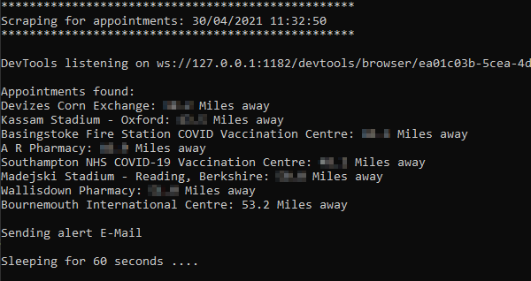
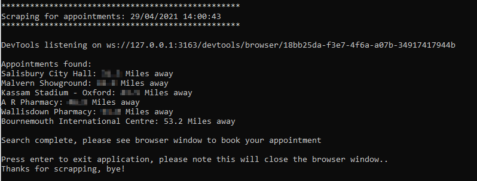

# NHS UK Covid Vaccination Scraper

Web scraper for NHS UK Covid vaccination appointments.

Features: 
* Automatically search for appointments every X seconds  
* Email alerts if appointments available within specific distance 
* Booking mode, to quickly get to the make booking page
* Writes results to log file 

## Setup 

This is a python3 script, you also require the correct ChromeDriver.exe for your installed version of Chrome which can be downloaded from here:

[Google ChromeDriver Download](https://sites.google.com/a/chromium.org/chromedriver/downloads)

Unzip the EXE into the same folder as the script.

Install requirements:

    pip install -r requirements.txt

Edit the peronsal, alert and email settings in the top of the script to required values.

## Running

To run in standard mode which will continuously loop and scrape appointments:

    python nhs.py 
    
To run in booking mode which will perform one search and leave the browser visible on screen:
    
    python nhs.py --booking

## Screenshots

Standard Mode

Booking Mode 

## Known Limitations 

Does not support the queuing system at peak times.

Not currently tested under Linux although should work. 

